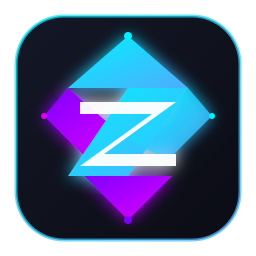

# ⚡ Zenith Launcher

<p align="center">
  
</p>

<p align="center">
  <b>Ультрасовременный, быстрый и красивый форк Prism Launcher в геймерском стиле (Lunar / Badlion / Cyberpunk)</b><br />
  С автоматической оптимизацией FPS в 1 клик, скинами Ely.by и умным менеджером Java.
</p>

---

## 🚀 Чем Zenith Launcher превосходит стандартный Prism Launcher

| Функция | Обычный Prism Launcher | ⚡ **Zenith Launcher** |
| :--- | :--- | :--- |
| **Дизайн и тема** | Классические серые таблицы Qt 2012 года | **Gamer Cyber UI**: глубокий темный фон, неоновый циан и фиолетовые акценты, карточки сборок |
| **Вид сборок** | Мелкие 48px иконки с текстом | **Стильные карточки-постеры** со статусом запуска, подсветкой и бейджами |
| **Кнопка Play** | Стандартная иконка на панели | **Крупная неоновая кнопка с градиентом и свечением** |
| **Оптимизация FPS** | Ручной поиск и установка модов | **«1-Click Boost»**: авто-установка Sodium, Iris, Lithium, FerriteCore при создании сборки |
| **Аккаунты и скины** | Требует аккаунт Microsoft для оффлайна | **Поддержка Ely.by «из коробки»**, свободный оффлайн-режим, интерактивный 3D-просмотрщик скинов |
| **Настройка Java** | Ручная установка и поиск пути | **Smart Java**: автоматический подбор и скачивание нужной Java (Temurin 8/17/21) прямо в лаунчере |
| **Discord RPC** | Базовый статус | **Продвинутый Rich Presence**: название сборки, версия, счетчик времени |

---

## 🎮 Ключевые возможности

### 1. Геймерский интерфейс (Cyber Edition)
- Высококонтрастная темная палитра `#0d0f17` с неоновыми градиентами (Electric Cyan & Cyber Violet).
- Карточки сборок со скругленными углами, неоновой рамкой при наведении и индикатором запущенной игры.
- Стильные тонкие скроллбары, современные вкладки и акцентные поля ввода.

### 2. Функция «1-Click FPS Boost»
При создании сборки достаточно оставить галочку **«⚡ Zenith Boost (FPS & Shaders)»** — лаунчер автоматически подготовит сборку с актуальными версиями:
- **Sodium** — колоссальный прирост частоты кадров.
- **Iris Shaders** — шейдеры нового поколения без просадок.
- **Lithium** — оптимизация тиков и физики сервера/клиента.
- **FerriteCore** — снижение аппетитов Minecraft к ОЗУ до 50%.
- **Entity Culling** & **ImmediatelyFast** — моментальный рендеринг сущностей и GUI.

### 3. Скины и аккаунты Ely.by
- Добавление аккаунтов Ely.by в 1 клик через раздел аккаунтов.
- Отображение пользовательских скинов и плащей без сложных манипуляций.
- Снято ограничение MultiMC/Prism на обязательное наличие купленной лицензии Microsoft для создания оффлайн-аккаунтов.

### 4. Smart Java Manager
- Больше никаких ошибок «Не найдена подходящая Java»!
- Лаунчер самостоятельно знает спецификации всех версий Minecraft и по умолчанию настроен на автоматическое скачивание и связывание требуемого рантайма.

---

## 🛠 Сборка и распространение

### Способ 1: Автоматическая облачная сборка через GitHub Actions (Рекомендуется)
1. Создайте форк или пушните данный репозиторий на ваш GitHub.
2. Перейдите во вкладку **Actions** -> **Zenith Launcher Windows Release**.
3. Нажмите **Run workflow** (выберите тип `Release`).
4. Облачный раннер GitHub скомпилирует готовые файлы `ZenithLauncher-Windows-Setup.exe` и `ZenithLauncher-Windows-Portable.zip`.

### Способ 2: Локальная сборка на Windows
В репозитории подготовлен вспомогательный скрипт:
```powershell
# Установка необходимых утилит (CMake, Ninja) через winget
.\scripts\build-windows-local.ps1 -InstallPrerequisites

# Сборка проекта
.\scripts\build-windows-local.ps1 -BuildType Release
```

---

## 📜 Лицензия
Zenith Launcher распространяется под свободной лицензией **GNU General Public License v3.0 (GPLv3)**.
Проект основан на наработках сообществ Prism Launcher и MultiMC.
